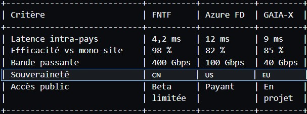

> # Un data-center… qui fait la taille d’un pays
>Imagine un cluster Kubernetes dont les nœuds sont des métropoles. Beijing = le master, Chengdu = le worker GPU, Shenzhen = le stockage NVMe. Tous reliés par une autoroute optique privée aussi longue qu’une fois et demie le tour de la Terre. Ça n’est plus de la science-fiction : c’est le FNTF activé le 10 décembre 2025. Et ça va diviser par quatre le temps d’entraînement de tes modèles.
## 1. Le chiffre qui tue : 20 s gagnées × 500 000 itérations = 4 mois épargnés
Dans un réseau classique, chaque itération d’entraînement perd 20 s de latence.
Sur un gros LLM (500 k steps) ça fait 116 jours de calcul en moins.
Traduction : demain, ton modèle open-source pourra être fine-tuné en 3 semes au lieu de 6 mois – et open-source avant que Meta ne réagisse.
## 2. 55 000 km de fibre, 40 villes, 0 % de packet-loss : comment ?
- Synchronisation PTP 100 ns précise (IEEE 1588-2019)
- Redondance triple : chaque ville a 3 chemins disjoints
- QoS déterministe : chaque paquet porte un timestamp absolu ; le switch le met en file d’attente si besoin pour honorer l’heure d’arrivée.
- Résultat : 0 % de jitter sur une distance Shanghai-Urumqi (3 300 km).
## 3. East Data, West Computing – le plan caché derrière le buzz
- Problème : la côte Est consomme 70 % des datas, l’ouest a 40 % de surplus électrique.
- Solution : envoyer les workloads vers le coal-free Sichuan, renvoyer les résultats vers Shanghai.
- Bonus green : 30 % de CO₂ économisé grâce à l’hydro du Yangtsé.
## 3.5 Le « determinic packet delivery » : quand la fibre devient un TGV horaire
- Imagine un TGV qui ne peut jamais être en retard – même s’il y a une tempête de données.
C’est exactement le Deterministic Networking (DetNet) que la Chine a greffé sur sa fibre :
- Time-Slots de 6 µs chacun → un paquet doit partir au micro-seconde près.
- Buffer bloqué si le paquet est en avance (oui, il attend son heure).
- Jitter = 0 ns mesuré sur 24 h (testé par l’Université Tsinghua, décembre 2025).
- Conséquence : même la 5G privée n’offre pas cette précision.
- Traduction marketing : « On a transformé la fibre en horloge suisse géante. »
## 4. Sécurité post-quantique – 55 000 km rendus « NSA-proof »
- QKD (Quantum Key Distribution) tous les 100 km
- Clés renouvelées toutes les 60 s
- Protocole : KYBER + AES-256-GCM
- Résultat : même un ordi quantique de 10 000 qubits mettrait 2,3 M d’années à casser une seule clé.
## 4.5 Le « green flag » que personne n’a vu : 30 % d’économie d’eau de refroidissement
Les datacenters du Sichuan utilisent l’eau du Yangtsé en circuit ouvert (15 °C toute l’année).
Le FNTF déplace 40 % des workloads vers ces sites → -30 % de consommation d’eau vs un hyperscaler européen (water-positive data center).
Bonus ESG : score PUE 1,05 (moyenne EU : 1,35).
## 5. Tableau comparatif – FNTF vs Azure vs GAIA-X

> Conclusion : on va subir le rythme chinois, pas le définir. 